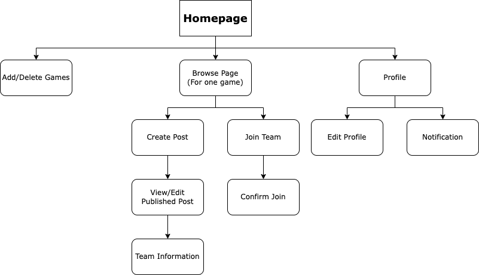
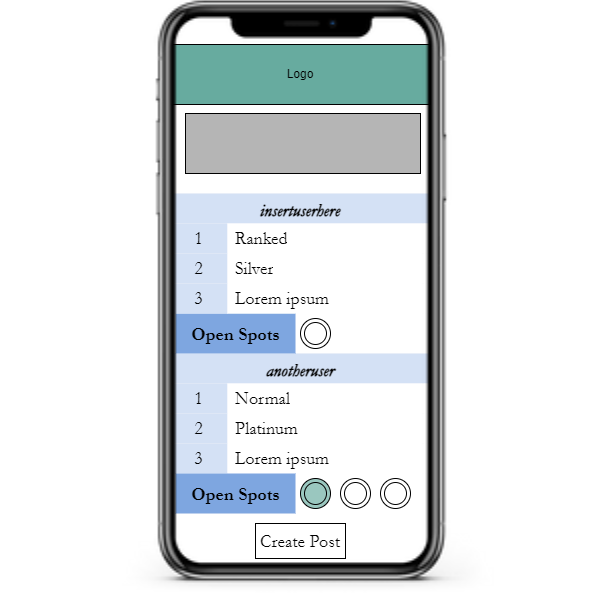
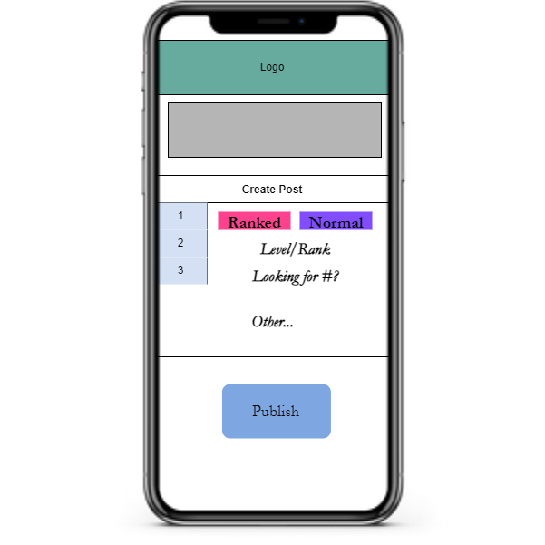
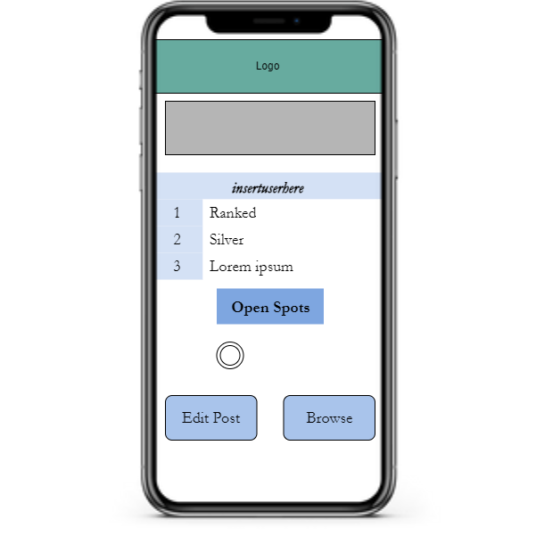
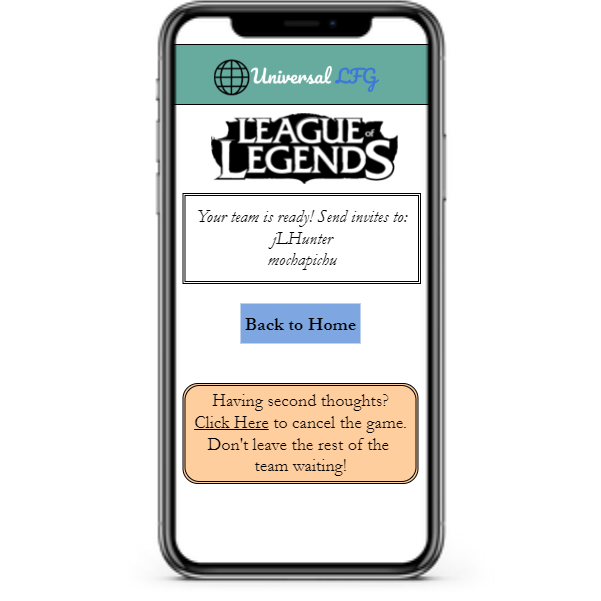
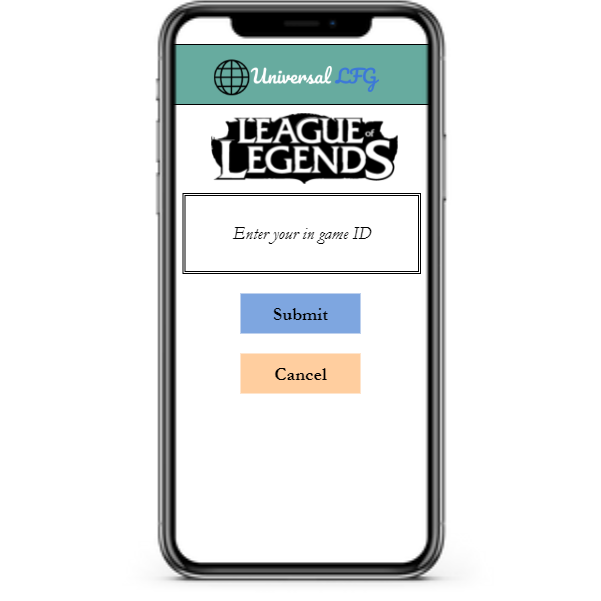
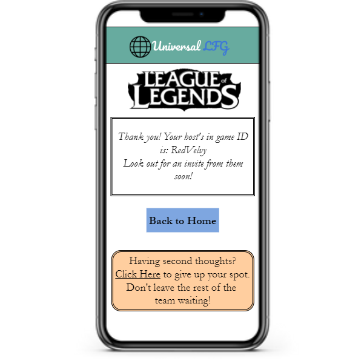

# User Experience Design

This repository contains instructions and files for two assignments that together comprise the user experience design phase of a web app.

Replace the contents of this file with the completed assignments, as described in:

- [app map & wireframe instructions](instructions-0a-app-map-wireframes.md).
- [prototype instructions](instructions-0b-prototyping.md)

# Site Map

# Wireframes

## Registration/Log In

* Stuff

## Home Page

* Stuff

## Post Creation, Browsing, and Joining Groups

Any user on the app can browse through posts created for the game they want to play. If a user wishes to make their own post, they can click the "Create Post" button to start the post creation process. See what browsing looks like below:

#### Host POV

If the user is a host wanting to create their own post and they click on the "Create Post" button in the previous wireframe, they will be taken to the following page, where they can select their preferred game mode (e.g. ranked, normal), the level/rank they play at, how many people they are looking for, and any other information:

Once a host has completed logging their preferences, they can publish their post and view the published version. Here, they can choose to edit their post, or go browse other posts:

When all the spots for a host's game has filled up, the app will notify the host and bring them back to their own post. If the host is still on the previous wireframe screen, the page will refresh automatically to show the following:

#### Non-Host POV

From the regular user's perspective, after browsing through posts, they might select to join a game. They can select a game by clicking on one of the empty circles next to the "Open Spots" sign on any post (see Browse Posts wireframe). They will then be taken to the following page, where they are asked to enter their in game ID, or cancel the spot selection:

If the user hits "Submit", they will be told the ID of their host, and will be given a tooltip to allow them to cancel their spot selection if they change their mind:

